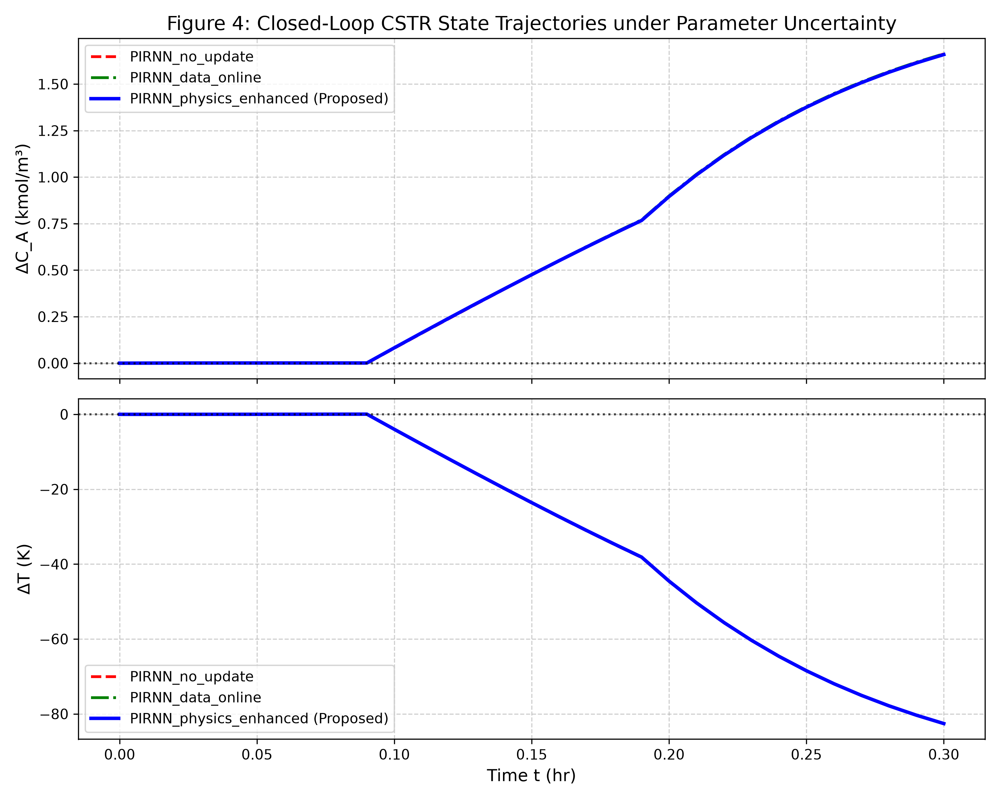
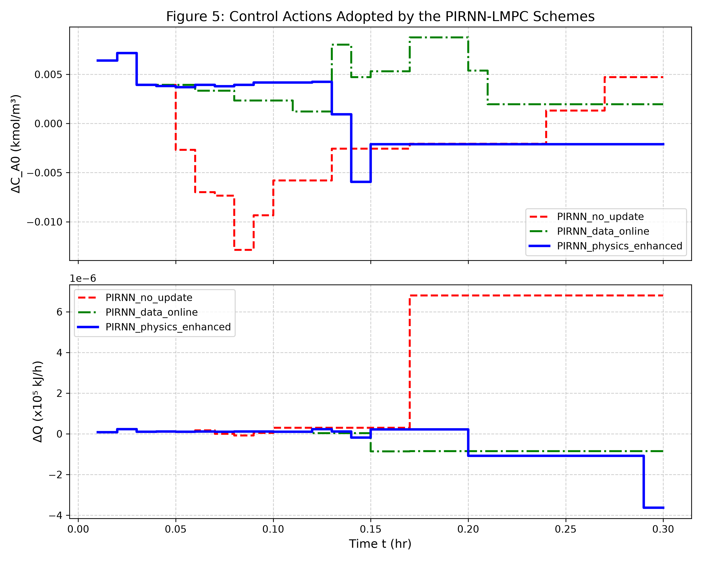
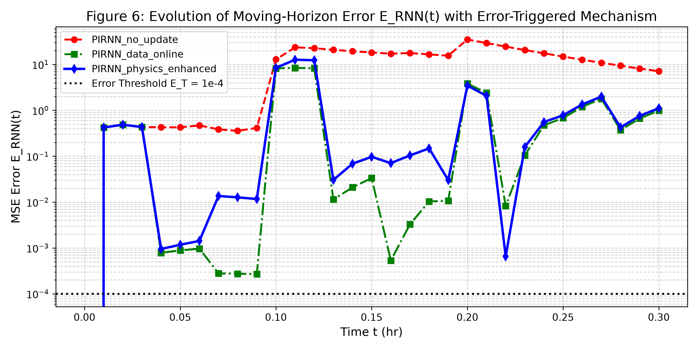

# Physics-Informed Recurrent Neural Network (PI-RNN) for CSTR Model Predictive Control

> **Master's Training Project — IIT Kharagpur**
>
> Implementation of a Physics-Informed Recurrent Neural Network integrated with Lyapunov-based Model Predictive Control (LMPC) for real-time control of a Continuous Stirred Tank Reactor (CSTR) under parametric uncertainty.

---

## 📌 Overview

This project implements the framework from:

> *"Physics-Informed Online Machine Learning and Predictive Control of Nonlinear Processes with Parameter Uncertainty"*
> — Ind. Eng. Chem. Res., 2023 ([DOI: 10.1021/acs.iecr.3c03691](https://doi.org/10.1021/acs.iecr.3c03691))

The key idea is to combine a **GRU-based Recurrent Neural Network** with **physics-informed loss functions** derived from first-principles CSTR governing equations. The model serves as a fast surrogate for MPC optimization, and adapts online when parametric drift is detected via an **error-triggered mechanism**.

### Key Features

- **Physics-Informed Training** — Hybrid loss function combining data-driven MSE and ODE residual penalties (Eq. 5 & 7 from paper)
- **Error-Triggered Online Adaptation** — Automatic re-training when prediction error exceeds threshold `E_T = 1e-4`
- **Joint Parameter Estimation** — Simultaneously estimates uncertain process parameters (`F`, `k₀`) during online updates
- **Three Comparison Schemes** — Static PI-RNN, data-only online update, and physics-enhanced online update (proposed)
- **MPC Integration** — SLSQP-based optimization using the PI-RNN as a trajectory predictor

---

## 🏗️ Project Structure

```
Master_Training_Project_iitkgp/
├── config.py                      # All CSTR parameters, hyperparameters, and paths
├── pirnn_model.py                 # PI-RNN model architecture (GRUCell) & physics residual
├── train_pirnn.py                 # Offline training with collocation data generation
├── cstr_env.py                    # CSTR plant simulator (scipy.integrate RK45)
├── mpc_controller.py              # PIRNN-based MPC controller (SLSQP optimizer)
├── run_closed_loop_simulation.py  # Closed-loop simulation with online adaptation
├── evaluate_metrics.py            # Quantitative IAE/ISE performance metrics
├── create_presentation.py         # Auto-generates project presentation
├── plots/                         # Generated result plots
│   ├── closed_loop_states.png     # Figure 4: State trajectories (ΔC_A, ΔT)
│   ├── control_actions.png        # Figure 5: Control inputs (ΔC_A0, ΔQ)
│   └── moving_horizon_error.png   # Figure 6: Moving-horizon error E_RNN(t)
└── checkpoints/                   # Saved model weights (gitignored)
```

---

## ⚙️ CSTR Process Model

The reactor follows second-order reaction kinetics with Arrhenius temperature dependence:

$$\frac{dC_A}{dt} = \frac{F}{V}(C_{A0} - C_A) - k_0 \exp\left(\frac{-E}{RT}\right) C_A^2$$

$$\frac{dT}{dt} = \frac{F}{V}(T_0 - T) + \frac{-\Delta H}{\rho_L C_p} k_0 \exp\left(\frac{-E}{RT}\right) C_A^2 + \frac{Q}{\rho_L C_p V}$$

| Parameter | Value | Unit |
|-----------|-------|------|
| Feed flow rate `F₀` | 5.0 | m³/h |
| Reactor volume `V` | 1.0 | m³ |
| Pre-exponential factor `k₀` | 8.46×10⁶ | m³/(kmol·h) |
| Activation energy `E` | 5.0×10⁴ | kJ/kmol |
| Feed temperature `T₀` | 300 | K |
| Steady-state concentration `C_As` | 1.95 | kmol/m³ |
| Steady-state temperature `T_s` | 402 | K |

---

## 🚀 Quick Start

### Prerequisites

- Python 3.8+
- PyTorch (with MPS/CUDA/CPU support)
- NumPy, SciPy, Matplotlib

### Installation

```bash
git clone https://github.com/DevanSF07/Master_Training_Project_iitkgp_devan.git
cd Master_Training_Project_iitkgp_devan
pip install torch numpy scipy matplotlib
```

### Run the Pipeline

**Step 1: Train the nominal PI-RNN model (offline)**

```bash
python train_pirnn.py
```

This generates 80,000 collocation trajectories using vectorized RK4 integration and trains the PI-RNN with the hybrid physics-informed loss function. The trained model is saved to `checkpoints/pirnn_nominal.pth`.

**Step 2: Run closed-loop simulation with online adaptation**

```bash
python run_closed_loop_simulation.py
```

Simulates the CSTR for 30 sampling periods (t = 0 to 0.3 h) across three control schemes:
1. `PIRNN_no_update` — Static model, no online adaptation
2. `PIRNN_data_online` — Data-only online model updates
3. `PIRNN_physics_enhanced` — Physics-enhanced online updates (proposed method)

Parameter disturbances are introduced at t = 0.09 h (F → 160%, k₀ → 80%) and t = 0.19 h (F → 230%, k₀ → 30%).

**Step 3: Evaluate quantitative metrics**

```bash
python evaluate_metrics.py
```

Computes IAE (Integral Absolute Error), ISE (Integral Squared Error), and mean prediction MSE for each scheme.

---

## 📊 Results

### Closed-Loop State Trajectories


### Control Actions


### Moving-Horizon Prediction Error


---

## 🧠 Model Architecture

```
Input: [x₀(2), u(2)] → 4 features
    ↓
FC Encoder: Linear(4, 64) → Tanh → Linear(64, 64) → Tanh
    ↓
GRU Recurrence: GRUCell(64, 64) × 10 sub-steps
    ↓
FC Decoder: Linear(64, 32) → Tanh → Linear(32, 2)
    ↓
Output: State trajectory (batch, 11, 2) [ΔC_A, ΔT]
```

**Loss Function:**
```
L_total = MSE_data + η × MSE_physics     (η = 0.1)
```

Where `MSE_physics` penalizes violations of the CSTR ODE residuals computed via finite differences over the predicted trajectory.

---

## 🔧 Configuration

All parameters are centralized in [`config.py`](config.py):

| Hyperparameter | Value | Description |
|----------------|-------|-------------|
| Hidden size | 64 | GRU hidden dimension |
| Learning rate | 1e-3 | Adam optimizer |
| Batch size | 2048 | Training batch size |
| η (physics weight) | 0.1 | Physics loss coefficient |
| Error threshold E_T | 1e-4 | Online update trigger |
| Sampling period Δ | 0.01 h | Control time step (36 s) |

---

## 📖 Reference

```bibtex
@article{wu2023physics,
  title={Physics-Informed Online Machine Learning and Predictive Control of 
         Nonlinear Processes with Parameter Uncertainty},
  journal={Industrial \& Engineering Chemistry Research},
  year={2023},
  doi={10.1021/acs.iecr.3c03691}
}
```

---

## 📜 License

This project is developed as part of the Master's Training Program at **IIT Kharagpur**, Department of Chemical Engineering.
